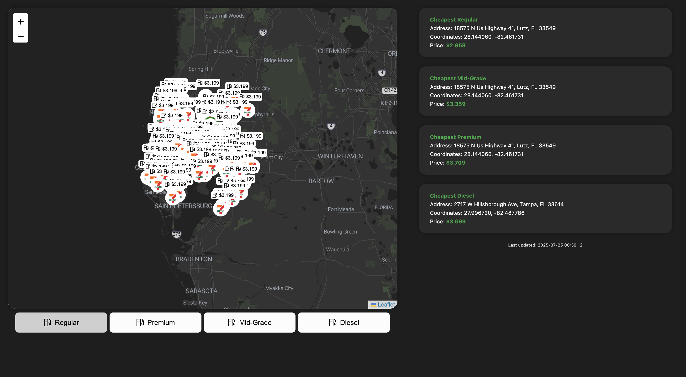
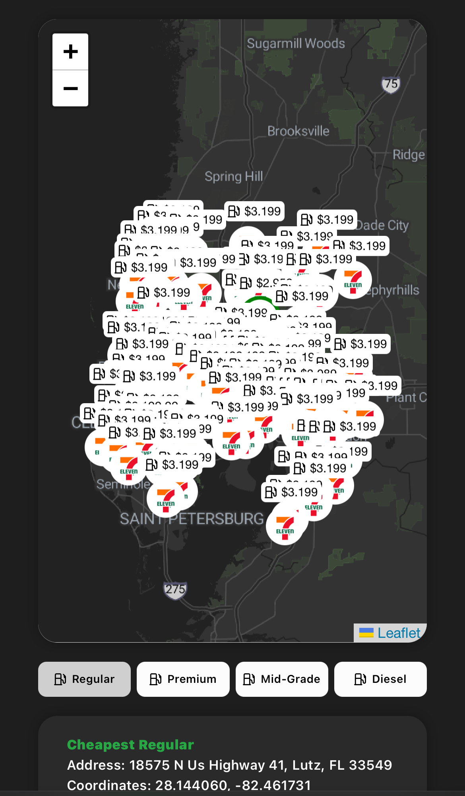

# ⛽ FuelFinder

**FuelFinder** is a full-stack web application that helps users find nearby gas stations and view updated fuel prices. Built with **Python** and **Javascript**, it offers a sleek, modern UI with updated location and fuel data integration.

🔗 **Live Site**: [https://fuelfinder-app.azurewebsites.net/](https://fuelfinder-app.azurewebsites.net/)

- 📍 **View Nearby Stations** — View gas stations in the Tampa Bay region
- 🗺️ **Map Integration** — See stations on an interactive Leaflet Map
- 💰 **Live Fuel Prices** — Up-to-date pricing information from original sources
- 🧾 **Station Details** — Name, address, fuel types, and more
- 💻 **Responsive Design** — Optimized for both desktop and mobile

## 📸 Preview

### 🖥️ Desktop View  
<kbd>  </kbd>

### 📱 Mobile View  
<kbd>  </kbd>

